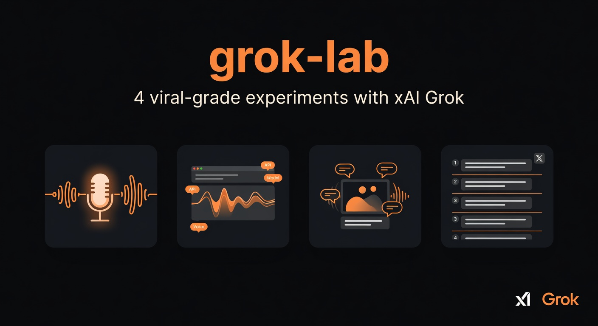

# grok-lab

[](https://cobusgreyling.github.io/grok-lab/)

**→ [View the interactive showcase on GitHub Pages](https://cobusgreyling.github.io/grok-lab/)** — enable GitHub Pages (Settings → Pages → Source: main branch + /docs folder) to publish.

> 4 production-ready, viral-grade experiments built on xAI's Grok models and realtime voice API.

**The goal**: Build things that showcase what makes Grok special (brutal honesty, real-time knowledge, wit, powerful tool use) in delightful, shareable ways — and make them easy for others to run, fork, and remix.

Each app is independently deployable (Vercel one-click friendly) and designed to be the kind of project that gets stars, clips, and forks.

## The Four Experiments

> **Current status (as of this commit):** All apps have polished, key-optional demos that run instantly. roast-voice and grok-threads call real grok-4.3 when you paste a key. Full low-latency realtime voice (WebSocket audio + tool calling in voice) is the big missing piece — the architecture + integration guide exist; a production-grade implementation (or LiveKit) is the natural next step.

| # | App | Core Idea | Purpose | Stack |
|---|-----|-----------|---------|-------|
| 1 | **[roast-voice](./apps/roast-voice)** | Brutally honest voice roasts | Showcase Grok's signature no-filter honesty with voice roasts + effortless clip export for viral sharing | Next.js + Web Audio + xAI Realtime |
| 2 | **[voice-lab](./apps/voice-lab)** | The clean reference Grok voice client | The canonical open-source reference implementation for voice + tools + personalities when talking to Grok | Next.js + full realtime client |
| 3 | **[voice-imagine](./apps/voice-imagine)** | Voice-directed image & video generation | Demonstrate natural voice-driven creative loops for image generation and live iterative refinement | Next.js + Realtime + Imagine API |
| 4 | **[grok-threads](./apps/grok-threads)** | Best-in-class X thread generator + previewer | Produce ready-to-post, high-engagement X threads with multiple angles and pixel-perfect live preview | Next.js + Chat Completions + thread UI |

## Why These?

- **Grok's personality is the product**. The "maximum truth-seeking" + humor angle is unique and extremely clip-worthy in voice.
- **xAI's realtime voice is legitimately good and cheap** (~$3/hr). Sub-second, tool calling (web + X search), multiple voices, expressive.
- **airi already owns the waifu companion niche** (40k+ stars). These apps deliberately avoid that lane.
- Each one has a clear "one weird trick" that makes people want to record and share.

## Quick Start (any app)

```bash
cd grok-lab/apps/roast-voice   # or voice-lab, voice-imagine, grok-threads
npm install
npm run dev
```

Open http://localhost:3000

**Get an xAI API key**: https://console.x.ai → create a key (free tier available for testing).

Most apps work in **demo mode** (browser SpeechRecognition + speechSynthesis) with zero config so you can see the UX immediately. Toggle "Real xAI Voice" and paste your key for the actual Grok voice + tools.

## Architecture Notes (Important for forks)

- Voice apps are structured for a **client-side xAI Realtime WebSocket client** (see `docs/REALTIME-INTEGRATION.md`). A reference `lib/xai-realtime.ts` + audio pipeline is the highest-leverage missing implementation.
- Audio: 16kHz PCM16 chunks via AudioContext + base64. Received deltas are queued and played with Web Audio.
- **Demo mode** is always available and delightful (great for screenshots and quick testing).
- For production / hiding keys / better barge-in: Put a thin proxy in `/api/realtime` or (recommended) use **LiveKit Agents + official xAI plugin**. The code is structured so swapping is straightforward.
- Text fallbacks use `https://api.x.ai/v1/chat/completions` directly from the browser for demos (key is client-side — fine for personal / demo use, add a server route for real apps).
- Image generation uses the xAI Imagine API (grok-imagine-image).

See `docs/REALTIME-INTEGRATION.md` for deep details + LiveKit migration path.

## Development

Each app is a standalone Next.js 15 + TypeScript + Tailwind project.

Common patterns you'll see:
- Dark, minimal, high-contrast UI (Grok aesthetic)
- Prominent API key modal + localStorage
- Live animated waveform component
- Export/share buttons (audio clips, thread text, image + prompt)
- Strong, opinionated system prompts that lean into Grok's voice

To run all at once (for local testing the whole lab):

```bash
# from root (you can add turbo or just use multiple terminals)
cd apps/roast-voice && npm run dev   # :3000
# new terminal
cd apps/voice-lab && npm run dev     # :3001 (update port in each if needed)
```

## Deploy

All four apps deploy beautifully to Vercel.

1. Fork / clone
2. For each app you want public: `vercel --prod`
3. Add `XAI_API_KEY` as an environment variable if you want server-side proxying (recommended for public demos).

## Contributing

This repo exists to be forked and remixed.

Ideas that would be huge:
- Better clip export (mix mic + Grok audio, auto-generate funny titles, upload to a temporary host)
- LiveKit / Pipecat versions of the voice apps (production VAD, phone support, multi-user rooms)
- A "Grok on a phone call" demo using LiveKit's SIP
- More personalities / system prompt packs
- Real X posting integration (with user consent) for the threads app
- Beautiful exported share pages (like `/clip/abc123`)

Open an issue or PR. If you're building something that gets real usage, I'd love to link it here.

## License

MIT — use the code however you want. Credit is nice but not required.

## Related

- Official xAI docs & cookbook: https://github.com/xai-org/xai-cookbook
- Realtime voice playground (LiveKit): https://grok.livekit.io/
- The big waifu one: https://github.com/moeru-ai/airi (respect the lane)

---

**Star the repo if these ideas are useful.** The fastest way to make Grok voice go mainstream is a bunch of high-quality, opinionated open source experiments.

Built with ❤️ for maximum truth-seeking AIs that you can actually talk to.
